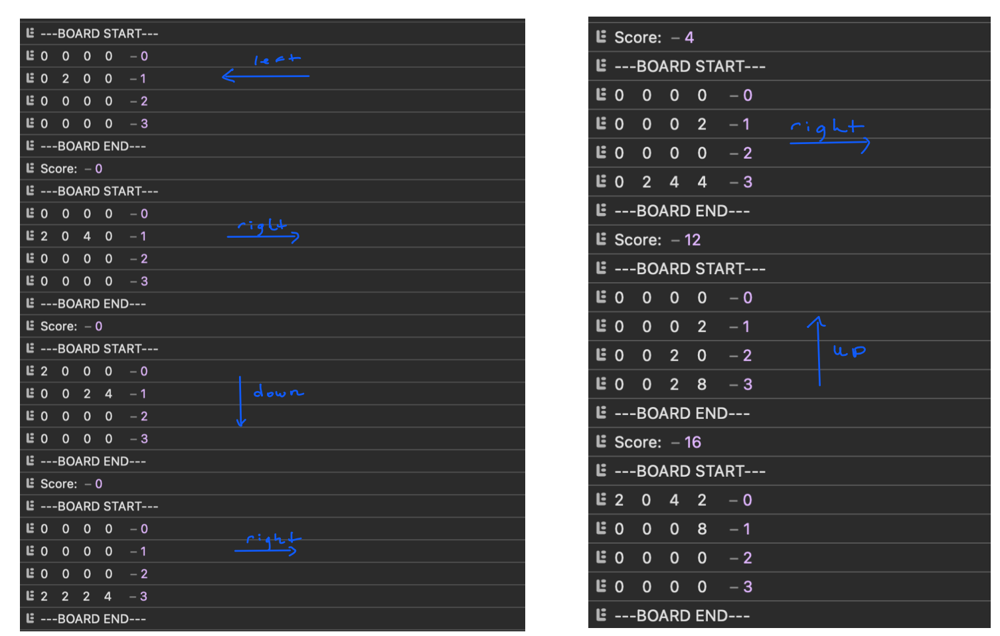

# Play 2048 on the browser console

Keep merging non-zero tiles until you reach 2048.

## How to play
Open the console and use the up, right, bottom, and left arrow keys to merge tiles with the same number. However, if the board has no more empty spaces, and no further valid moves it means game over.

## About
 I enjoy this game that I decided to learn the mechanics about it. This project allowed me to practice 2D array manipulation and apply object oriented programming. That said, a concept from linear algebra was used such as the `transpose`. This project can be further expanded to a web game with sliding animations such as the original one. 

A sample run through on my console. The `blue arrows` indicate the directions taken. In this case `left`, `right`, `down`, `right`, `right`, `up` with a score total of 16.